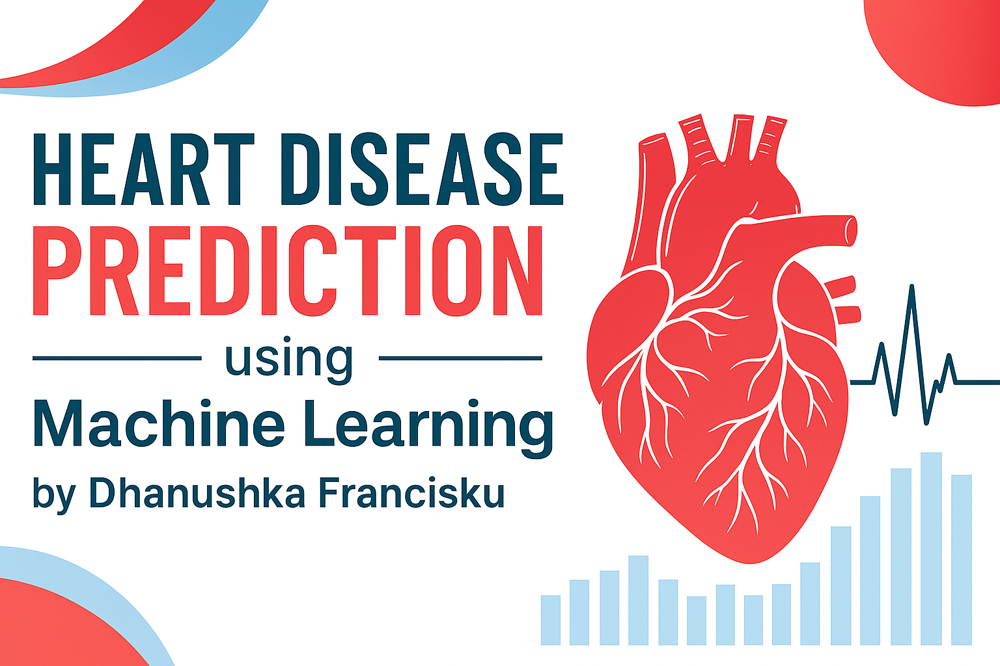

  

Machine Learning project predicting heart disease using Logistic Regression and Random Forest.
# 🩺 Heart Disease Prediction using Machine Learning  

This project predicts the likelihood of **heart disease** based on clinical and diagnostic data using supervised machine learning models.  
It was developed as part of my **Kaggle portfolio** to demonstrate end-to-end data science workflow — from EDA to model evaluation.

---

## 📘 Project Overview

Using the **UCI Heart Disease Dataset**, I explored relationships between patient health factors and heart disease diagnosis.  
The goal was to build a predictive model that can assist with early risk identification.

---

## ⚙️ Workflow Summary
1. Data preprocessing and cleaning  
2. Exploratory Data Analysis (EDA)  
3. Feature encoding and missing value handling  
4. Model training – Logistic Regression & Random Forest  
5. Hyperparameter tuning using GridSearchCV  
6. Model evaluation (Accuracy, Recall, F1, AUC)  
7. Feature importance analysis and insights

---

## 📊 Results
| Model | Accuracy | Recall (Heart Disease) | F1-Score |
|--------|-----------|------------------------|-----------|
| Logistic Regression | 0.793 | 0.84 | 0.82 |
| Tuned Random Forest | 0.783 | 0.83 | 0.81 |

- Logistic Regression provided the best balance of interpretability and accuracy.  
- Key predictive features: `oldpeak`, `exang`, `thalach`, and `cp`.

---

## 🧠 Technologies Used
- Python (Pandas, NumPy, Matplotlib, Seaborn)
- Scikit-learn (Logistic Regression, Random Forest, GridSearchCV)
- Jupyter / Kaggle Notebooks

---

## 🔗 Links
- 📄 **Kaggle Notebook:** [Add your Kaggle link here]
- 💻 **Author:** [Dhanushka Francisku](https://github.com/yourusername)

---

*This project demonstrates practical machine learning applied to healthcare — focusing on interpretability, accuracy, and reproducibility.*
